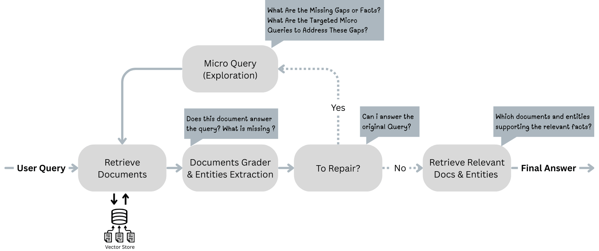

# SEAL-RAG

**Replace, Don't Expand: Mitigating Context Dilution in Multi-Hop RAG via Fixed-Budget Evidence Assembly**

[](https://www.python.org/downloads/)
[](https://opensource.org/licenses/MIT)
[](https://github.com/langchain-ai/langgraph)

> 📄 [Paper (arXiv)](https://arxiv.org/abs/2512.10787) | [HuggingFace Papers](https://huggingface.co/papers/2512.10787)

---



## Overview

SEAL-RAG is a training-free controller for Retrieval-Augmented Generation that targets **precision at small k** under predictable budgets. Unlike methods that broaden context (increasing cost and noise), SEAL-RAG actively **repairs** missing evidence by replacing low-utility passages with targeted micro-queries.

### Key Features
- 🔄 **Loop-Adaptive Control:** `Search` → `Extract` → `Assess` → `Loop` cycle.
- 🎯 **Entity-Anchored Repair:** On-the-fly extraction of missing entities and relations.
- ⚖️ **Fixed-K Replacement:** Maintains a constant context size (e.g., k=3) to ensure predictable latency.
- 📊 **Reproducible Benchmarks:** Full evaluation pipeline for HotpotQA and FEVER.
- 🛠️ **Modern Stack:** Built with LangGraph, Pinecone, and OpenAI.

---
 
## Quick Start

**Prerequisites:** 
- Python 3.11+
- OpenAI API key
- Pinecone API key

### 1. Install dependencies

```bash
uv python install 3.11
uv sync
```

### 2. Set up environment

```bash
cp env.example .env
# Edit .env and add your API keys:
# OPENAI_API_KEY=sk-...
# PINECONE_API_KEY=...
```

### 3. Data & Indexing (Crucial for Reproducibility)

To reproduce our results, you must use the specific 1,000-question validation slice and the Wikipedia snapshot used in our experiments.
- **Verify Data:** Ensure `data/hotpot_1k.jsonl` exists in the repository.
- **Build Index:** Run the indexing notebook to populate your vector store.

```bash
uv run jupyter notebook indexing.ipynb
```

### 4. Run the graph

**Option A: Interactive UI (LangGraph Studio)**

```bash
uv run langgraph dev
# Open http://localhost:2024 in your browser
```

**Option B: Python API**

```python
from src.workflow_manager import build_seal_rag_graph

graph = build_seal_rag_graph()
result = graph.invoke({"user_query": "Which city hosted the Olympic Games in the same year that the band Blur released the album Parklife?"})
print(result["final_answer"])
```

---

## Experiments & Reproduction

We provide the exact scripts used to generate the results in the paper.

### Notebooks

| Notebook | Description |
| :--- | :--- |
| `indexing.ipynb` | **Setup:** Builds the Pinecone index from the corpus. |
| `experiment.ipynb` | **Evaluation:** Runs the full pipeline (SEAL vs Baselines) over the dataset. |
| `statistical_confidence.ipynb` | **Analysis:** Performs McNemar's tests and Paired t-tests on the results. |

### Running from CLI

You can also run experiments via the command line:

```bash
# Run SEAL-RAG on the 1k slice with k=3 and loop budget=3
bash scripts/run_main.sh \
  --model gpt-4o \
  --k 3 --L 3 \
  --config ./configs/default.yaml \
  --slice ./data/hotpot_1k.jsonl \
  --out ./runs/reproduction_run
```

---

## Configuration

The graph parameters can be adjusted at runtime via `configurable`:

| Parameter | Default | Description |
| :--- | :--- | :--- |
| `model` | `openai:gpt-4o` | LLM backbone (supports 4o, 4o-mini, 4.1) |
| `retriever_k` | `1` | Fixed number of documents to maintain in context |
| `repair_loop_limit` | `3` | Maximum number of repair iterations (L) |
| `pinecone_index_name` | `seal-v3-hard` | Target vector store index |

**Full configuration reference:** [`src/modules/configuration.py`](src/modules/configuration.py)

---

## Results Data

Raw experimental results (CSVs) are included for verification in `src/files/experiment_comparison/`:

- 📂 k=1 Experiments (`seal_k_1_model_*.csv`)
- 📂 k=3 Experiments (`seal_k_3_model_*.csv`)
- 📂 Ablation Studies

---

## Project Structure

```
.
├── src/
│   ├── files/             # Experimental results & assets
│   ├── modules/           # Core logic (Extraction, Ranking, Gate)
│   ├── other_rags/        # Baseline implementations (Self-RAG, CRAG, Basic)
│   └── workflow_manager.py # LangGraph construction
├── data/                  # Seeded datasets (HotpotQA 1k slice)
├── experiment.ipynb       # Main evaluation notebook
├── statistical_confidence.ipynb # Statistical analysis notebook
└── README.md
```

---

## Citation

If you use this code or data in your research, please cite our paper:

```bibtex
@inproceedings{lahmy2026sealrag,
  title     = {Taking RAG Systems to the Next Level: Reasoning That Doesn't Blow Up Your Context},
  author    = {Lahmy, Moshe and Yozevitch, Roi},
  booktitle = {2026 IEEE Swiss Conference on Data Science (SDS)},
  year      = {2026},
  publisher = {IEEE}
}
```

An extended version with additional analyses and full experimental details is available on arXiv:

```bibtex
@article{lahmy2025replace,
  title   = {Replace, Don't Expand: Mitigating Context Dilution in Multi-Hop RAG via Fixed-Budget Evidence Assembly},
  author  = {Lahmy, Moshe and Yozevitch, Roi},
  journal = {arXiv preprint arXiv:2512.10787},
  year    = {2025}
}
```

---

## License

This project is licensed under the MIT License - see the [LICENSE](LICENSE) file for details.
